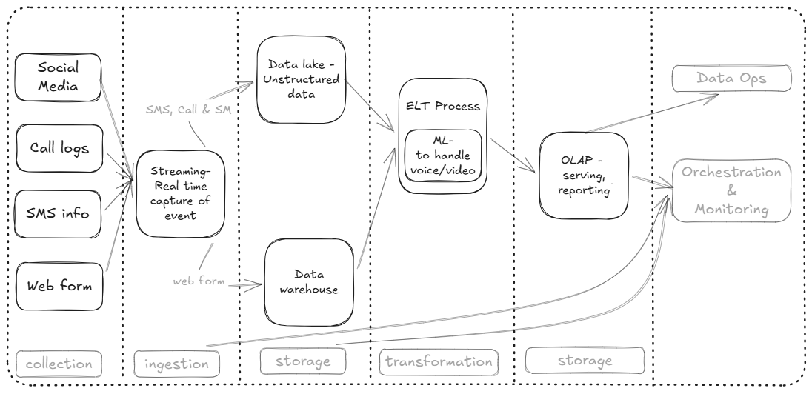

# cde_Data_Engineering_Fundamentals_Assignment

## Questions can be found: 

## Answers:

1. Conceptual pipeline

2. Solution Design

2.1 Source Identification
Four primary data channels serve as the inputs for the complaint: social media, Call logs, SMS info, and Web forms. In this pipeline, all incoming channels are centralized into a single ingestion checkpoint rather than managing separate batch pipelines for different data sources.

2.2 Ingestion Strategy
Ingestion is streaming – for Real time capture of events. Rather than handling call logs on a delayed batch schedule, all four channels feed into this continuous collection point to ensure immediate event availability and resolving any compliant in real time. The data collected in this complaint activity are of two types: 
* SMS, Call & SM events are unstructured.
* Web form is structured.

2.3 Storage (Data Lake & Data Warehouse)
The storage layer is divided into two repositories running in parallel to handle distinct data structures:
* Data lake - Unstructured data: Receives the continuous stream of raw, unformatted events originating from social media, Call logs, and SMS info.
* Data warehouse: collets web form data.

2.4 Transformation (ELT Process & Machine Learning)
This pipeline employs an ELT (Extract, Load, Transform) model. Data is extracted from sources and loaded completely into their respective storage layers (Data Lake and Data Warehouse) prior to any manipulation. This helps us have history of the data even after data pre-processing activities. Within this layer, a dedicated Machine Learning algorithm - to handle voice/video interpretation/conversion to text. 

2.5 Serving
Downstream consumption is powered directly by the OLAP - serving, reporting layer. Management of dashboards, business intelligence analytics, and operational alerting systems run their workloads against these governed analytical tables rather than querying the raw data lake or transactional data warehouse.

2.6 Orchestration & Monitoring
Orchestration & Monitoring acts as a foundational backbone linked directly to the operational pipeline. It continuously tracks and manages execution dependencies across three specific layers.

3. Design Choices and Rationale
* Real-Time Ingestion: All four sources—including call logs—are routed through a single streaming capture layer to eliminate batch infrastructure overhead and unify the ingestion checkpoint.
* ELT Approach Over ETL: Data is written to storage first (Data Lake and Data Warehouse) and transformed after loading. This ensures raw historical data is permanently preserved and allows the transformation logic to be re-run or modified without re-ingesting data from the sources.
* In-Pipeline Machine Learning Activity: Help to handle call logs (voice/video) to help analysis at the serving stage

4. Challenges and Unknowns
* ML Inference Latency: Voice and video processing via ML models is computationally heavy and could create a processing bottleneck within the ELT step if data volumes spike.
* Real-time Event Reconciliation: Stitching together a single customer's journey across distinct channels (e.g., cross-referencing an SMS info event with a processed voice recording from a Call log) on-the-fly within an ELT workflow.
